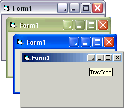



## Titlebar Button

### Description

A button that you would use to minimise your app to the system tray.

I liked a submission made earlier by AB Software (code id = 58679) but didnt like the need for external controls and bas files.

This submission does the same job but everything is contained within one usercontrol making it easy to just drop into any project.

It has its limitations and there is scope for further development. If I do anything further on it I will post updates.

Feedback appreciated.

Acknowledgements made within the code where appropriate.
 
### More Info
 

             |
---                |---
**Submitted On**   |2005-02-06 16:11:02
**By**             |[GDuncan](https://github.com/Planet-Source-Code/PSCIndex/blob/master/ByAuthor/gduncan.md)
**Level**          |Intermediate
**User Rating**    |4.9 (117 globes from 24 users)
**Compatibility**  |VB 6\.0
**Category**       |[Graphics](https://github.com/Planet-Source-Code/PSCIndex/blob/master/ByCategory/graphics__1-46.md)
**World**          |[Visual Basic](https://github.com/Planet-Source-Code/PSCIndex/blob/master/ByWorld/visual-basic.md)
**Archive File**   |[Titlebar\_B184924262005\.zip](https://github.com/Planet-Source-Code/gduncan-titlebar-button__1-58741/archive/master.zip)

